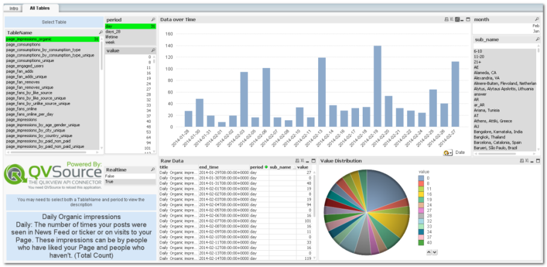
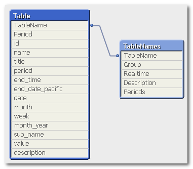

QVSource Facebook Insights Starter App For QlikView
===================================================
IMPORTANT - You will need QVSource 1.6.1 or later to run this application (which contains V3 of the Facebook Insights Connector for QlikView).

This is a starter QlikView application showing how to get started using the [QVSource Facebook Insights Connector](http://wiki.qvsource.com/QlikView-Connector-For-Facebook-Insights-(v2).ashx) for QlikView.

If you are a QlikView + QVSource user you can simply click the ["Download ZIP"](https://github.com/QVSource/QVSource-Facebook-Insights-Starter-App-For-QlikView/archive/master.zip) button on GitHub to grab this application.

The content below is copied from the change log in the first tab of the load script.

Change Log
----------
Version 1.0.1 - 01/06/2015
--------------------------
* Updated to use V3 of the Connector.

Version 1.0.0 - 28/02/2014
--------------------------
* Initial version with new V2 of the Connector.
